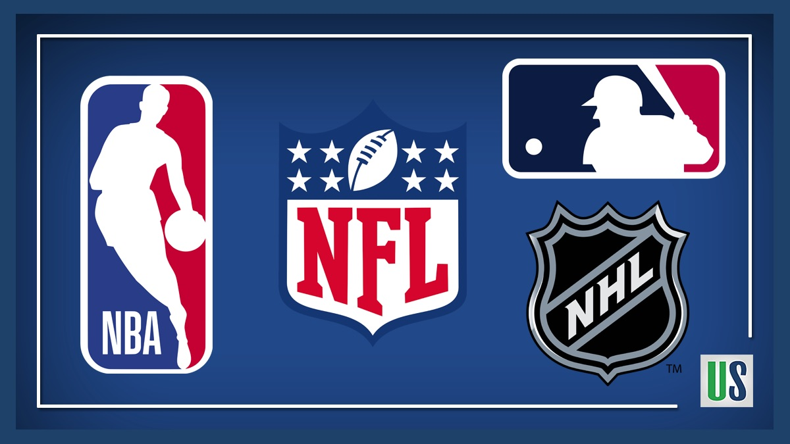

# Pro_Sports_Salary_Analysis

Analyzed the salaries of professional athletes across the 4 major North-American Sports Leagues, the NFL, NBA, MLB and NHL for the period of 1991-2017.

## MVP1 - Tableau Analysis

## Table of Contents
- [Overview](#overview)
- [Aim](#aim)
- [Technologies](#technologies)
- [Data](#data)
- [Analysis & Visualization](#analysis--visualization)
- [Challenges](#challenges)
- [Summary](#summary)

## Overview
The first iteration of this project (MVP1) will analyze the salaries of professional athletes as well as the total team payrolls (total salary expenditures on players) of the 4 major North American Sports Leagues, the NFL, NBA, MLB and NHL. Finalizing in Tableau Dashboard and a story. 

## Aim
To deliver analysis and provide insights into the money involved in professional sports over recent decades. 

## Technologies 
- Python 3.10.11
    - pandas, NumPy, Matplotlib, Seaborn
- Jupyter Notebook
- Tableau Public Desktop 2024.1.1

## Data
### Collection
Data was collected by online search, from the Sports Leagues Datasets from [zenodo.org](https://zenodo.org/records/3256432). This allowed me to acquire player and team salary data for all 4 major leagues. 
### Cleaning & Processing
Several steps were needed in the cleaing & formatting process. A total of 8 csv's were imported, 4 for each league by player and 4 for each league by team. A sample initial DataFrame prior to cleaning looked as follows:

* Replacing missing values listed as 'Unknown' with `np.nan` for proper NULL storage.
* Data type conversion of certain salary column values from `object` to numerics like `Int64`
* String-removal of periods, used in the initial data for thousand separators. Eg: 450.00 --> 450000
* Various incorrect salary value corrections, needing to be replace with accurate salary information. Or in the instance of the Team Payroll data, with the league average as accurate data was unavailable online. 
* Addition of a **League** column to store the respective league for later joining and melting of the DataFrames. 
* Melting of the DataFrames was necessary. Where all the Year columns were pivoted to single **Salary** or **Team Payroll** column for ease of analysis, flexibility and visualization purposes among other reasons. 
The cleaning and melted (pivoted from wide format to long) Team & Player DataFrames are as follows: 
 

## Analysis & Visualization
### MVP1 Tableau
The Player and Team data were visualized in Tableau by creating:
- Line plot to display average player salary and team payroll by year and league.
- Bar plot showing the highest player salary per league across the whole dataset.
- An area chart representing total team payroll by year and league.
- 2 year filters to filter data by desired year timeline 
- Heatmap visualizing the median team payroll by league and year.

## Challenges
Overall data quality presented the most challenges for MVP1. Difficulty initially finding complete ready-to-extract files were hard, side note data scraping for MVP2 should bring much cleaner and accurate data. Once a nice complete dataset was acquired, the shear size of it presented challenges in assuring cleaning was complete. As mentioned earlier, several value inconsistencies were not found under at times during the EDA process. This required some backtracking and cleanup that was not ideal consider the later stage I was in. Although the thorough initial processes of cleaning, processing and EDA led me to discover them so I can look at that as somewhat of a silver lining. Better to find earlier than later in the dashboard and visualization process. 
## Summary
At the end of MVP1 an interactive Tableau analysis was complete. Consisting of:
- 2 Dashboards, a Player dashboard visualizing the salaries of players in the 4 sports leagues and a Team dashboard analyzing the team expenditures on player salaries
- A "Tableau Story" developing a narrative to my data, focusing on the growth of the 2 financial variables (player salary & team payroll)
